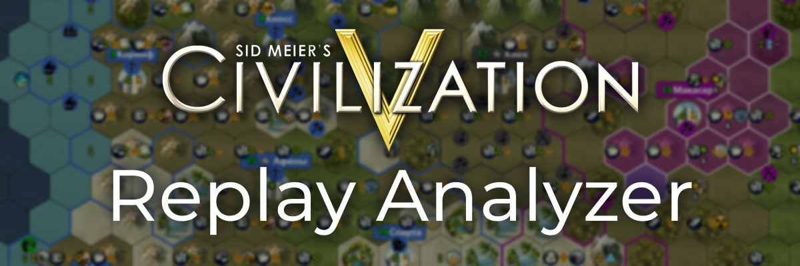

<p align="center">
  
</p>

<h1 align="center">Civ5 Replay Analyzer</h1>

<p align="center">
  
  
  
</p>

> **Интерактивный веб-инструмент для просмотра и анализа реплеев Civilization V.**
> Позволяет воспроизвести партию ход за ходом, изучить экономику, науку, микро и макро менеджмент и перемещение войск на детальной карте.

---

## О проекте

Я часто играю в Civilization V с друзьями, но нам всегда не хватало одной вещи — реплеев. В любой серьезной мультиплеерной стратегии, от StarCraft 2 до шахмат, есть инструменты для разбора партий. В Civ5 такой функции нет, и модов тоже — движок игры слишком неповоротлив и на практике не позволяет создать подобную модификацию.

Я решил разобраться в Civ5 SDK и нашел лазейку: можно встроиться скрипт в UI игры и который будет выводить необходимую информацию об игре в системные логи.

Так как опыта во фронтенде у меня не было, я решил попробовать Vibe Coding. За пару недель прототип был готов.

Проект всё еще в стадии Beta. Код требует рефакторинга, а некоторые функции (вроде Тумана Войны) пока отсутствуют. Но как Proof of Concept для компании друзей-цивилизаторов инструмент уже полностью рабочий.

---

## Возможности

### Интерактивная карта
Полноценный рендер карты Civilization V в браузере.
*   **Таймлайн:** Плавная навигация по ходам.
*   **Слои:** Отображение ресурсов, юнитов (военных/гражданских), городов и границ.
*   **Yields:** Визуализация доходов с каждой клетки (Еда, Производство, Золото и т.д.).


### Аналитика и Графики
Детальные графики по каждому игроку, недоступные в самой игре:
*   Эффективная наука/культура (с учетом штрафов за города).
*   Население, Золото, Вера, Военная мощь.
*   Счетчик ходов Золотого Века.
*   Панель **Build**, отображающая хронологию постройки зданий, юнитов, основания городов


### Деревья Развития
*   **Технологии:** Визуализация изученных технологий для каждого игрока.
*   **Культура:** Просмотр принятых институтов.
*   **Религия:** Пантеоны и верования.


---

## Архитектура

Проект состоит из трех независимых частей, связанных потоком данных:

1.  **In-Game Logger (Lua):** Внедряется в UI игры. Каждый ход сканирует карту (`Map.GetPlot`), игроков и города, сериализует данные в JSON и печатает их в `Lua.log` чанками, чтобы обойти лимит буфера строки.
2.  **Data Pipeline (Python):**
    *   `watcher.py`: Слушает файл лога в реальном времени, собирает чанки обратно в JSON и сохраняет сессию.
    *   `export.py`: Компилирует разрозненные сессии в единый `data.js` для фронтенда.
3.  **Viewer (Frontend):** SPA на **Vue 3** + **PixiJS**. Рендерит гексагональную сетку и интерфейс.

```meramid
graph TD
    A[Civ5 Game Engine] -->|Hook| B(ReplayLogger.lua)
    B -->|Chunks| C[Lua.log File]
    C -->|Tail| D[watcher.py]
    D -->|JSONL| E[replays/session.jsonl]
    E -->|Merge| F[export.py]
    F -->|JS Object| G[data.js]
    G -->|run Webserver| H[Web Viewer Vue + PixiJS]
```

---

## Как запустить

### 1. Установка мода (Lua Logger)
1.  Скопируйте файл `lua/ReplayLogger.lua` в папку игры:
    `.../Sid Meier's Civilization V/Assets/DLC/Expansion2/UI/InGame/`
2.  Отредактируйте `InGame.xml` в той же папке, добавив в конец:
    ```xml
    <LuaContext FileName="ReplayLogger" Font="CR_Civ5_Tooltip" Hidden="1" />
    ```
3.  Включите логирование в `config.ini` игры (`LoggingEnabled = 1`, `EnableLuaDebugLibrary = 0`).

### 2. Сбор данных
1.  Запустите скрипт прослушки:
    ```bash
    python python/watcher.py
    ```
2.  Играйте в Civ5. Скрипт будет автоматически сохранять ходы в папку `replays/`.

### 3. Просмотр
1.  Экспортируйте данные:
    ```bash
    python python/export.py
    ```
2.  Запустите локальный сервер (из-за ограничений CORS браузеры не откроют текстуры просто так):
    ```bash
    python python/launcher.py
    ```
    *Или соберите .EXE файл с помощью `python build.py`.*

---

## Технологии

*   **Frontend:** [Vue.js 3](https://vuejs.org/)
*   **Graphics:** [PixiJS](https://pixijs.com/)
*   **Charts:** [Chart.js](https://www.chartjs.org/)

---

**TODO:**
- [ ] Поддержка популярных мультиплеерных модификаций (LEK Mod, FireStorm FFA patch) 
- [ ] Туман войны
- [ ] рефакторинг python и js кода (вайбкодинг оставляет желать лучшего по качеству кода)
